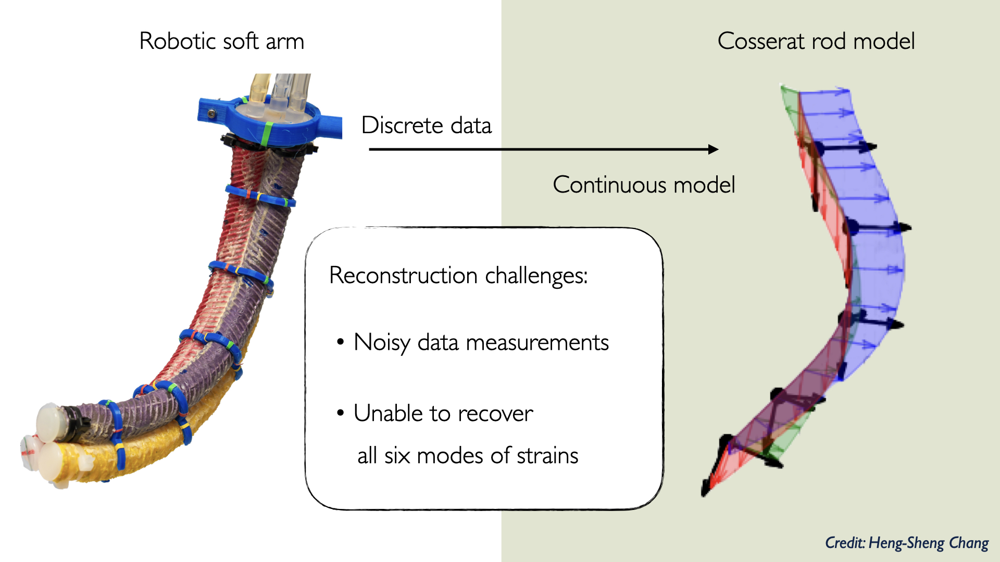

# soft-arm-strain-reconstruction-from-video

Soft manipulators are popular in the area of soft robotics. They are inspired by nature like octopus arms, snakes and elephant trunks, and people have tried to design and create soft manipulators that can reach the high dexterity and maneuvability. At the same time, becuase of the systems' nonlinearity and continuity, it is hard to control these soft systems or even to learn the underlying strategies from animals. Motivated by this, we provide a framework to use video data to reconstruct the six modes of deformation of slender soft bodies. The proposed mathematical formulation for shape estimation is physics-informed, based on the use of the special Cosserat rod theory whose equations encode slender body mechanics in the presence of bending, shearing, twisting and stretching. We perform experiments on two kinds of soft manipulators (fiber-reinforced and cable-driven), and obtain results that are accurate and robust to noise. The framework can be applied for the characterization in laboratory settings of robotic prototypes or biological systems.

## Reconstruct continuous deformation
Here we have a soft manipulator with 5 tracking markers, and we want to reconstruct the continuous deformation. The challenges come from (1) the position measurements from video data are sparse and noisy and (2) how to recover all six modes of continuous strains. 

Intuitively, we can formulate the following optimization problem: given the marker positions, we want to find control u that minimizes the [potential energy of the rod](https://github.com/chshih2/Real-time-control-of-an-octopus-arm-NNES) and the cost of the data mismatch, subject to the kinematic constraint of the rod. However, this formulation gives us discontinuous strains. 
To get continuous strains, we formulate the optimization problem in terms of finding a decision variable that puts constraints on strain evolution. In addition, we put a regularization term on the decision variable in the objective function to ensure the continuous strains are smooth.

## Obtain marker positions and directions from video

To capture the motion, we have 5 cameras around the arm to record the location of the marker points. Marker points are placed around and across the arm, and collected points are interpolated to estimate the cross-sectional plane of the arm. We calibrate the cameras with flags in 3d-grid layout across workspace and use DLT method to map the image data to 3d space. To automate the data collection process, we use optical flow algorithm, implemented in OpenCV. Because of the rotational deformation, few occlusion cases needed to be handled carefully.

## Experiments

